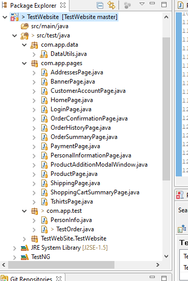

# Automation

Java project has been committed to Git as per the assignment.

Use of libraries
1. Selenium webdriver
2. TestNG
3. Chromedriver

PageFactory object model has been used to develop the framework.
  1. Page object for revelant screens were created
  2. Created page objects were used in the test.
  
 
  
  
  
DataUtils class
  1. Class was used to send data to Test class

Furthure improvement could be 
  1. Use of excel sheets for data. Currently, data is being passed through dataprovider class keeping in view of simplicity of assignment. 
  2. Use of Listner classes for making reports more interactive and detailed. 
  3. Use of RetryAnalyzer to run failed test cases again in case if failed due to slowness. 
  
 
